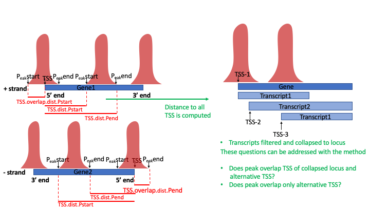
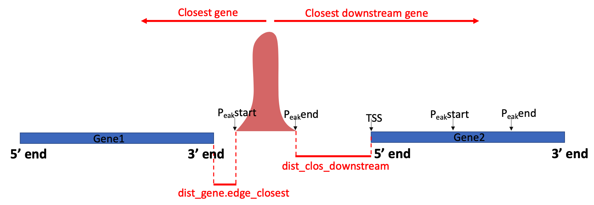

# scATAC.Peak.annotation
Annotate peaks in scATAC experiments to its closest genes, derive common peak sets and gene activities. 

## Description
A tool for scATAC data to test whether scATAC peaks fall onto transcriptional start sites(TSS), or gene bodies and if not, Peaks can be annotated to closest downstream and closest general gene and the respetive distance is computed. If the Peak falls onto the TSS of a gene the distance of the peak's start or end to the TSS is computed depending on whether the gene is on the + or - strand, respectively. If the peak falls onto a gene body the distance of the peak's start and end to the gene's TSS is computed which allows testing for overlap of alternative TSS. In addition scATAC.Peak.annotation allows to derive gene activities by aggregating the fragment counts of peaks falling onto the same gene within cells. Lastly given that peak calling algorithms, such as Cellranger-atac, derive different peak sets if peaks are called on different datasets, scATAC.Peak.annotation allows inference of a common peak set.   

## Vignette

### Install required packages
``` r
install.packages("devtools")
library(devtools)
install_github("PatZeis/scATAC.Peak.annotation")
```

``` r
library(scATAC.Peak.annotation)
```


### get gene annotations from a given gtf file.
Get gene annotation from a given gtf file with information for chromosome, gene start/end,gene element, coding and transcript support level(TSL). Annotation can be filtered for coding information and TSL. Filtered transcripts of the same gene are collaped to a common gene locus but information about alternative TSS are kept.     
``` r
gtf <- "~/genomes/Homo_sapiens.GRCh38.106.gtf"
```
####Examples
``` r
anno <- get_annotation(gtf)
anno2 <- get_annotation(gtf, coding = c("processed_transcript", "protein_coding"), TSL=T, TSLfilt = 1)
```


### filter out genes spanning a large range.
This function filters out genes which span a region larger than a given threshold.
``` r
anno_small  <- too_large(anno)
```


### prolong gene range upstream of TSS.
This function prolongs the gene ranges in the annotation upstream of TSS by a given number to include the promoter region or other proximal regulatory elements.
``` r
anno_prolong <- prolong_upstream(gene_element = anno_small)
```


### Annotate peaks which fall onto genes.
This function annotates given peaks with the gene(s) they fall onto. Input is as character vector with chromosome, start- end end position. It can be further annotated  whether peaks are overlapping the TSS or gene body. Furthmore the range peak spans before the TSS is computed if peak overlaps TSS or the distance from peak start and peak end is computed if gene falls onto the gene body.   
``` r
peak_genes <- peaks_on_gene(peak_features = rownames(merged_atac_filt), annotations = anno) ### peak features e.g. rowname of cellranger-atac output file features.tsv with chromosome:Peak.start-Peak.end
``` 
<h1 align="center"></h1>


### Annotates peaks to closest gene.
This function annotates peaks which do not fall onto genes to its closest downstream as well as closest genes in general(if closest gene is not downstream of peak). The distances to closest (downstream) genes of each peak is also calculated and returned. 
``` r
closest_gene  <- peaks_closest_gene(peaks=peak_genes, annotations=anno)
``` 
<h1 align="center"></h1>

### Aggregate peak counts falling onto the same gene to gene activities
This function takes the output of peak_on_gene function run with TSSmode=F, and a peak-cell matrix.mtx (with rownames derived from features.tsv and colnames derived from barcodes.tsv) as input and aggregates peaks falling onto the same genes to a gene-activity count matrix.

``` r
peak_genes <- peaks_on_gene(peak_features = rownames(merged_atac_filt), gene_element=anno_prolong, TSSmode=F)
activity <- give_activity(peak_genes, merged_atac_filt)
``` 


### Get combined overlapping peak set.
This function takes the peaks which have been called on different samples by e.g. Cellranger-atac, and thus could represent overlapping peaks with different start and or end positions to provide an overlapping peaks set.
``` r
combined.peaks <- give_combined_peaks(atac_layer) ### atac_layer = list object with each slot containing peak-cell matrix for a sample with (with rownames derived from each features.tsv and colnames derived from each barcodes.tsv)
``` 


### Annotate peaks to overlapping peaks.
This function annotates peaks which have been called on different samples, and thus could represent overlapping peaks with different start and or end positions to a provided overlapping peaks e.g. output of combined.peaks-function. In addition a provided peak-cell count matrix can be aggregated across the common overlapping peak set.
#### Examples
``` r
merged_atac_filt <- merge_samples(atac_layer) ## merges peak-cell matrix for each samples exhibiting a slot in atac_layer list
overlapped_peaks <- peak_overlap(peak_features=rownames(merged_atac_filt), combined.peaks=combined.peaks)
overlapped_peaks <- peak_overlap(do.aggregate=T, peak_matrix=merged_atac_filt,insert_run1 = overlapped_peaks)
```


### Merge peak-cell count matrices.
This function takes the peak-count matrices for different samples, stored in a list with a slot for every sample and merges these matrices.
``` r
atac_layer_merged <- merge_samples(atac_layer)
```  
